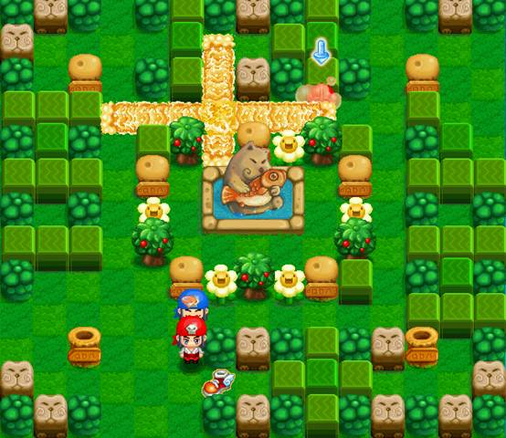
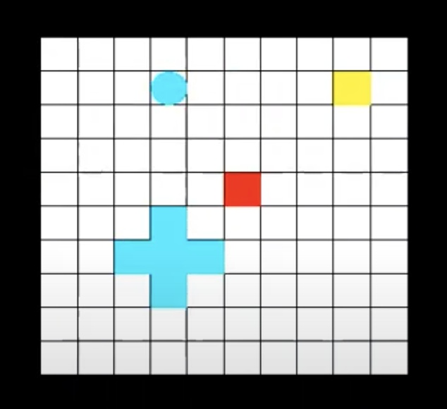
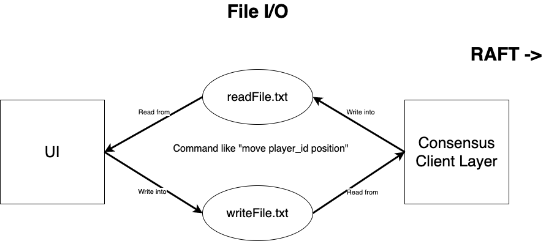
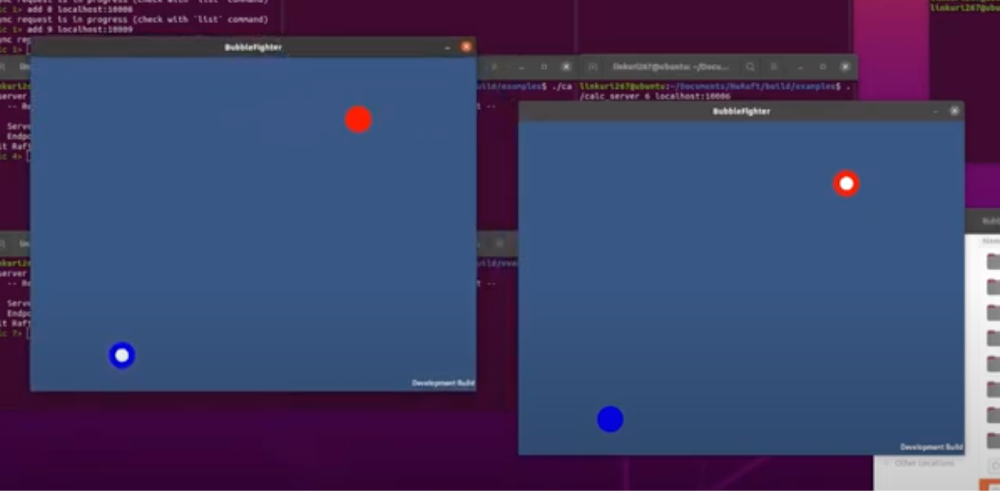

---
# Feel free to add content and custom Front Matter to this file.
# To modify the layout, see https://jekyllrb.com/docs/themes/#overriding-theme-defaults

layout: page
---

  

  

    

  

 <b>Inspiration:</b>  BubbleFighter is inspired by a 2D casual competitive game, QQTang. When the game starts, all players are divided into two sides, and each person controls a character. Arrow keys control the movement, and the sugar bubble will be put by pressing the space. Sugar bubbles will explode syrup after 5 seconds. If the character touches the syrup, it will be trapped and suffocated to death after 5 seconds.At this time, if the companion walks by, he can be rescued, and if the opponent walks by, he will die immediately. One more line.

<!-- At this time, if the companion walks by, he can be rescued, and if the opponent walks by, he will die immediately. When all our team members died, the game was lost. Some powerups can be picked up to promote attributes of the player such as the speed, the upper bound of the number of bubbles and the power of explosion.   -->

---
---  

<b id="architecture">GAME NETWORK ARCHITECTURE </b>

  

<pre>
• We present a game network that utilizes the consensus protocol RAFT implementation.  • Additionally, we introduce learning algorithms for RAFT optimization.  • The game is currently built on a grid-based UI.  • We have also integrated RSA signatures and validators for encryption and security.
</pre>

<!-- Thank you for stopping by. Yes,  __I'm on the job market!__ 

 I am a second-year CS graduate student at the [University of Southern California](https://www.usc.edu/) in sunny Los Angeles. Before this, I spent two wonderful years as a Research Engineer in the [Department of Computer Science and Engineering](https://www.cse.iitb.ac.in/) at [IIT Bombay, India](https://www.iitb.ac.in/). I was advised by **[Dr. Pushpak Bhattachary](https://www.cse.iitb.ac.in/~pb/)**, and I have been fortunate to work closely with him at the [Center for Indian Language Technology](http://www.cfilt.iitb.ac.in/).  My research/__interest__  broadly focuses on Machine Learning and Natural Language Understanding. I am also a ACM SIGCHI Scholar and have experience in Human Computer Interaction/ User Experience research.

 I want machines to not just ***learn***, but also ***understand*** complex ideas the way we do, especially with ***natural languages***. Last summer, I built a state-of-the-art [Contextually Complex Phrase detection]() system.

During the summer of 2017, I worked on [Probabilistic Models for Intelligent Text Input Processing]() as a research intern in the Human-Computer Interaction (HCI) group at the IDC School of Design (IDC Dept), IIT Bombay, India, where I was advised by **[Dr. Anirudha Joshi](http://www.idc.iitb.ac.in/~anirudha/){:target="_blank"}**.

In spring 2017, I worked on [Multi-Scale 3D Convolutional Neural Network models]() during my internship at **Nvidia, Pune, India**, where I was lucky to be jointly advised by [Dr. CP Mammen](https://in.linkedin.com/in/cp-mammen-7690735) and [Dr. Jayashree Kalpathy Crammer](https://connects.catalyst.harvard.edu/Profiles/display/Person/102986) (MGH, Harvard Medical School).

I graduated in 2017 from VIT, Pune with distinction in Bachelors of Information Technology. Before that, I earned a Diploma in Computer Science Engineering with distinction from PCP, Pune in 2014.

In my spare time, I have begun contributing to [StackOverflow](https://stackoverflow.com/users/9370096/nikhil-wani.){:target="_blank"} and writing [articles](). Outside of research, I like to play Cricket and participate in social events. I'm always looking for new, interesting people to interact with.

You can find my research delineated [here](http://localhost:4000/research/), or peruse a detailed [CV](http://localhost:4000/research/). -->

---
---  

<b id="demo">GAME DEMO </b>

<iframe width="560" height="315" src="https://www.youtube.com/embed/rH38I3Cda44" title="YouTube video player" frameborder="0" allow="accelerometer; autoplay; clipboard-write; encrypted-media; gyroscope; picture-in-picture" allowfullscreen>

</iframe>

 

<!-- 

<b id="demo">GAME NETWORK ARCHITECTURE </b>

  

We present a game network that utilizes the consensus protocol RAFT implementation. Additionally, we introduce learning algorithms for RAFT optimization. The game is currently built on a grid-based UI. We have also integrated RSA signatures and validators for encryption and security.

 -->

---
---

<b>GAME LAYER</b>

Game layer is the frontend, the UI. We tried 2 ways to build and integrate the UI, including using Simple and Fast Multimedia Library (SFML) and the Unity3D.

  

  

 
• <b>UI by SFML</b>  
Firstly, we used SFML by C++ and built a simple UI shown as follows, which contained a grid-based map, 2 players (squares) and each of which could drop some bombs (circles). SFML is multi-media, multi-platform and multi-language. The five modules including system, window, graphics, audio and network ease the development of games and multimedia applications. Also, players on different platforms are able to interact with each other.

  In order to integrate the UI with the raft layer, we used file I/O, the architecture of which is as the following diagram. A readFile.txt and a writeFile.txt are the bridge to connect the UI and the consensus client layer. When the player moves in the UI, the movement will be converted as a command like “move player_id position”, and be written into the writeFile.txt, so the consensus client layer is able to read the movement and execute it in the raft process. Identically, when some other players send a movement command by raft, the consensus client layer will write the movement command received into the readFile.txt, so the UI will read from it and update the status.

  

  
  

  The reason why we decided to implement this way is because of the error of compilation integration. As we used the NuRaft framework, it has a complicated and complete compilation system. The UI we achieved relies on the SFML package, and it needs to make up a dependency in the compilation process. However, we were not able to find a way to integrate the two compilation processes together. Therefore, the file I/O became a good option.

  However, there was a new problem coming out with the file I/O. When the game layer and the consensus client layer read and wrote the file at the same time, there would be some contents getting missed, so the performance of moving synchronization was not very good. Therefore, we tried to use Unity3D. On the one hand, it had the better UI looking. On the other hand, we could use TCP/IP protocol instead of using the file I/O.

• <b>UI by Unity3D</b>  
  

  
  

 

---
---  

 
<b id="about">ABOUT US</b>

<svg class="svg-icon"><use xlink:href="{{ '/assets/minima-social-icons.svg#linkedin' | relative_url }}"></use></svg>
<a href="https://www.linkedin.com/in/david-chen-783a1a110/" target="_blank">David Chen</a>

&nbsp;
&nbsp;
&nbsp;
&nbsp;
&nbsp;

<svg class="svg-icon"><use xlink:href="{{ '/assets/minima-social-icons.svg#linkedin' | relative_url }}"></use></svg>
<a href="https://www.linkedin.com/in/yunyi-liao-a9132919b/" target="_blank">Yunyi Liao</a>

&nbsp;
&nbsp;
&nbsp;
&nbsp;
&nbsp;

<svg class="svg-icon"><use xlink:href="{{ '/assets/minima-social-icons.svg#linkedin' | relative_url }}"></use></svg>
<a href="https://linkedin.com/in/nikhilwani" target="_blank">Nikhil Wani</a>

<!-- <video width="480" height="320" controls="controls">
  <source src="https://www.youtube.com/watch?v=rH38I3Cda44" type="video/mp4">
</video> -->
